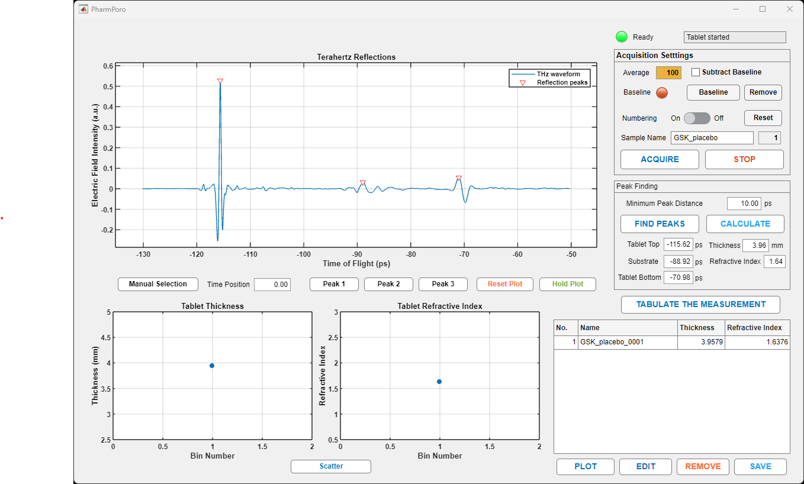

# PharmPoro (Terahertz Pharmaceutical Tablet Porosity Measurment Software)
- See below UI image
- Note: only compatible with MenloSystems TeraSmart
  

**Installation guide (standalone version)**

> Please download [PharmPoroInstaller_web.exe](PharmPoroInstaller_web.exe) and run it on your local computer as decribed below.

 

## MATLAB Application Installation:
 -	Run the PharmPoroInstaller_web.exe file (an internect connection is necessary for installation.)
 -	The MATLAB Installer will launch. Click **Next**.
 -	At the ‘Select destination folder’ step, leave ‘Add shortcut to desktop’ **UNCHECKED**.
 -	Click **Next**, then click **Begin Install**

## Add Shortcut to Desktop:
 -	Right-click and drag the PharmPoro.exe file at C:\Program Files\PharmPoro\application\ to Windows Desktop
 -	Select **Create shortcut to here.**
 -	Right-click the shortcut and select **properties.**
 -	At the Shortcut tab, click **Advanced…**
 -	Check **Run as administrator.**
 -	Click **OK** and **OK**

>**Please run PharmPoro as administrator!!!**

## Python Installation (for PharmPoro and CaTx4Menlo):
  A: Setting Python environment
  1.	Install Python 3.9.13 (May 17 2022) - compatible with MATLAB version > R2021a
  2.	Customize installation
  3.	Install launcher for all users check!
  4.	Add Python 3.9 to PATH
  5.	Check all options
  6.	Customize install location: Browse -> C:\Python\Python39
  7.	Install -> complete

  B. Package installation
  (Windows command prompt) <- Windows search "cmd" (enter)
  - pip install PyQt5 (enter)
  - pip install websockets (enter)
  - pip install numpy (enter)
  - pip install astropy (enter)

  C: Setting Windows path 
  - Windows taskbar -> Search with 'environment variables' -> Edit the system environment variables
  -> Advanced tab -> Environment Variables button -> New
  -> Name: PYTHONPATH, Value: -> Browse directory: C:\Python\Python39\Lib\Site-packages (site-package directory)
  -> OK -> OK

 

# **For the source code modification**

PharmPoro.mlapp is a MATLAB App-Designer (version r2023a) file and runs on MATLAB environment. If MATLAB is not installed in your PC, please visit https://uk.mathworks.com/products/matlab.html and install the latest version before you run PharmPoro. 

In the repository, there is a pair of .mlapp and .m files. Basically, .m file is a text version of .mlapp for code-reviewing and version-tracking and not necessary for running the tool. In case you modify *.mlapp file and commit it back to the repository, please update and upload the associated .m file as well so that users can easily track the changes in the code.

Please follow the instructions below.
1. **MATLAB** needs to be installed in your computer to modify PharmPoro.
2. Download *.mlapp and \Images files.
 - **PharmPoro.mlapp** : CaTx4Menlo MATLAB App-designer file
 - **.\images\CaT_logo.png** : logo image
 - **.\images\dotTHz_logo.png** : logo image
3. Double click **PharmPoro.mlapp** to launch the software.

For detailed descriptions for CaTx4Menlo and step-by-step tutorial, please visit [dotTHz documentation](https://github.com/dotTHzTAG/Documentation).
